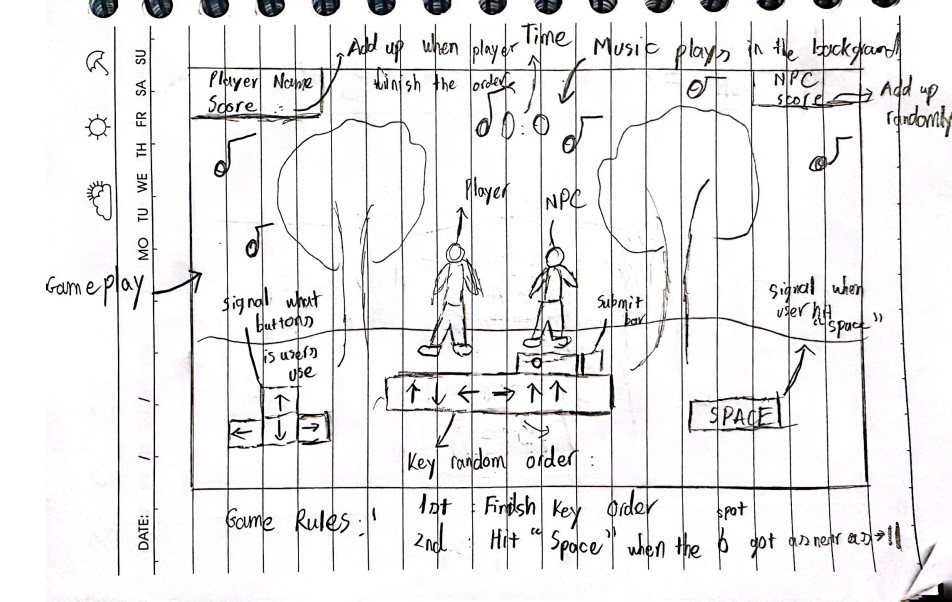

:warning: Everything between << >> needs to be replaced (remove << >> after replacing)

# Listen to the beat
## CS110 Final Project  Fall, 2023

## Team Members

Harry Do 
Gilbert Kim 

***

## Project Description

We are going to make a rhythm game. So first the player will choose the song they liked>
and difficulty level. Then they get transfer to the game. Where the players have to finish 
a combo of shuffle button to get the score while listening to their song. The player will against the
computer. In the end, we will compare the players score with the computer to determine who is the winner.

***    

## GUI Design

### Initial Design

### Final Design

## Program Design

### Features

1. Main loops where the game start and end depends on users choose: start_screen==>gameloop==>gameoverloop==>start_screen(if the player want to play more) 
2. Combos of buttons that players have to finish to gain their points 
3. Shuffle both background, music and taskbar every time the player start a new game 
4. Mathematical features calculate the number of combo users have to win for each songs and the time limit before the song ends. 
5. Losing menu when player miss more than 10 times

### Classes

- << You should have a list of each of your classes with a description >>

## ATP
Project: Rhythm Game 
    Test Case 1: Key reflected while pressed:
        Step 1: Start the game.
        Step 2: Press key “w”, “a”, “s”, “d”, and “space”
        Step 3: A blink of light yellow will be displayed in the pressed key. For example if users press "w", the key "w" on the screen gonna turn "yellow" and back to "purple". This will signal whether the key the users pressed is as the same as the data input to the computer
        Step 4: If the key does't blink could be the keyboard input is in another language 
    Test Case 2: Make sure all the images is shown on the screen:
        Step 1: Start the game.
        Step 2: Check the images in these game state.
                - If users are in the mainloop. They should see the screen pictures with "Play" button.
                - If users are in the menuloop. They should see the image of a disc and the name of songs below it. 
                - If users are in the gameloop. They should see, the image of the following key: “w”, “a”, “s”, “d”, and “space” and a rectangle rounded corner shape between "space" and “w”, “a”, “s”, “d” key which we call it the obstacle taskbar.
                - If users are in the gameoverloop. They should see the score board that compared the minimum hit you should get to win this round, how many correct answers, wrong answers you get and the number of time you hit "space" to reset those key and move to the next one
        Step 3: If some of the following images don't show up on the screen, it could be the problems with the file path. Because the file path for images are different between window, Mac, and linux
    Test Case 3: Checking features in the mainloop:
        Step 1: Start the game
        Step 2: The game will automatically get into the mainloop first
        Step 3: To check the features in the mainloop. Users should be able to click "Play" button which will help them to get to the next state: "menuloop()".
        Step 4: Verify that the feature working correctly.
    Test Case 4: Checking features in the mainloop:
        Step 1: Start the game
        Step 2: The game will automatically get into the mainloop first. Click the "Play" button to get to the : "menuloop()".
        Step 3: In the menuloop(). users should be able to see the image of disc with some name of the song beneath it 
        Step 4: Users choose wanted song to get to the next state gameloop()
        Step 5: Verify that the feature is working
    Test Case 5: Checking features in the gameloop:
        Step 1: Start the game
        Step 2: After users are able to go through the mainloop and menuloop. Users get to the gameloop
        Step 3: In the gameloop(). First, users will be notified the number of hit users have to get to win the game based on the song they choose. Then when the song started, a line of key: "w", "s", "a", "d" will appear randomly and wait for the players finish. If the users answers are correct, the key will turn yellow, if the answers are wrong, the key will appear red. Users can hit "space" key to change to the next combo. However, the number of correct and wrong answers in the previous key is still saved to calculate the score.
        Step 4: The game will end when the song stopped with the current score they got   
        Step 5

                - If users are in the mainloop. 
                - If users are in the menuloop. Users should see the image of a disc and the name of songs below it. Users will be choose which song they want to play with the game and then get transfer to the gameloop.  
                - If users are in the gameloop, you should see, the image of the following key: “w”, “a”, “s”, “d”, and “space” and a rectangle rounded corner shape between "space" and “w”, “a”, “s”, “d” key. We call it the obstacle taskbar.
                - If users are in the gameoverloop. You should see the score board that compared the minimum hit you should get to win this round, how many correct answers, wrong answers you get and the number of time you hit "space" to reset those key and move to the next one

