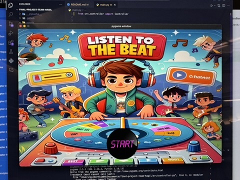

:warning: Everything between << >> needs to be replaced (remove << >> after replacing)

# Title: Listen to the beat

## CS110 Final Project Fall, 2023

## Team Members

Harry Do
Gilbert Kim

---

## Project Description

We have made a rhythm game which the player win by completing a assigned combo until the song we randomly assigns ends. The combos which is the aim to win is automatically assigned;if the random song length is more than 4 minutes the combos is gonna be 350, and if not, it's gonna be 250. They will encounter a main screen with a play button. Once they click the play button, the game will start after 3 seconds count. To win the game, the player has to complete assigned combos while making less than 20 errors. When the player had made a errors more than 20, the player will see a game over screen after the set there doing (The player has to end the set there doing to see the game over screen). The player can return to home by clicking the home button or refresh to start the game again. Also, The player can refresh the set pressing space button, if they don't to complete the random set they have to finish. Once they finish all combos they will win.

---

## GUI Design

### Initial Design

### Final Design

## Program Design

### Features

1. The menu that transfer the player to the game when you click the main screen
2. Combos of buttons that players have to finish to gain their points
3. Shuffle both background, music and taskbar every time the player start a new game
4. Mathematical features calculate the number of combo users have to win for each songs and the time limit before the song ends.
5. Losing menu when player miss more than 20 times

### Classes

- Taskbar, Obstacle, Group, Button, mutagen (Citation: Mutagen. mutagen. (n.d.). https://mutagen.readthedocs.io/en/latest/)

## ATP

Project: Rhythm Game
Test Case 1: Key reflected while pressed:
Step 1: Start the game.
Step 2: Press key “w”, “a”, “s”, “d”, and “space”
Step 3: A blink of light yellow will be displayed in the pressed key. For example if users press "w", the key "w" on the screen gonna turn "yellow" and back to "purple". (For mac users, you can hardly watch blinck not our fault)
Step 4: If the key does't blink could be the keyboard input is in another language
Test Case 2: Make sure all the images is shown on the screen:
Step 1: Start the game.
Step 2: Check the images in these game state. - If users are in the mainloop. They should see the screen pictures with "Play" button. - If users are in the gameloop. They should see, the image of the following key: “w”, “a”, “s”, “d”, and “space” and a rectangle rounded corner shape between "space" and “w”, “a”, “s”, “d” key which we call it the obstacle taskbar. - If users are in the gameoverloop. They should see the score board that compared the minimum hit you should get to win this round, how many correct answers, wrong answer.
Step 3: If some of the following images don't show up on the screen, it could be the problems with the file path. Because the file path for images are different between window, Mac, and linux
Test Case 3: Checking features in the mainloop:
Step 1: Start the game
Step 2: The game will automatically get into the mainloop first
Step 3: To check the features in the mainloop. Users should be able to click anywhere in the main screen which will help them to get to the next state: "menuloop()".
Step 4: Verify that the feature working correctly.
Test Case 4: Checking features :
Step 1:
Step 2: The game will automatically get into the mainloop first. Click the "Play" button to get to the : "menuloop()".
Step 3: In the menuloop(). users should be able to see the image of disc with some name of the song beneath it
Step 4: Users choose wanted song to get to the next state gameloop()
Step 5: Verify that the feature is working
Test Case 5: Checking features in the gameloop:
Step 1: Start the game
Step 2: After users are able to go through the mainloop and menuloop. Users get to the gameloop
Step 3: In the gameloop(). First, users will be notified the number of hit users have to get to win the game based on the song they choose. Then when the song started, a line of key: "w", "s", "a", "d" will appear randomly and wait for the players finish. If the users answers are correct, the key will turn yellow, if the answers are wrong, the key will appear red. Users can hit "space" key to change to the next combo. However, the number of correct and wrong answers in the previous key is still saved to calculate the score.
Step 4: The game will end when the song stopped with the current score they got  
 Step 5

                - If users are in the mainloop.
                - If users are in the menuloop. Users should see the image of a disc and the name of songs below it. Users will be choose which song they want to play with the game and then get transfer to the gameloop.
                - If users are in the gameloop, you should see, the image of the following key: “w”, “a”, “s”, “d”, and “space” and a rectangle rounded corner shape between "space" and “w”, “a”, “s”, “d” key. We call it the obstacle taskbar.
                - If users are in the gameoverloop. You should see the score board that compared the minimum hit you should get to win this round, how many correct answers, wrong answers you get and the number of time you hit "space" to reset those key and move to the next one
